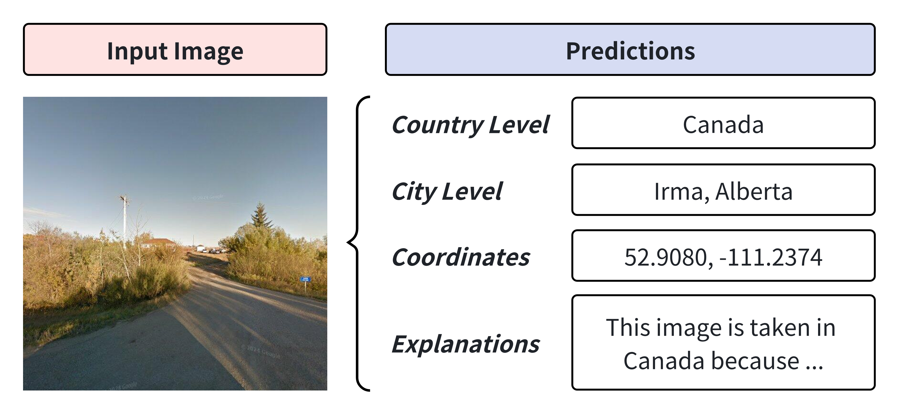

# 📍Awesome-Geo-localization
A Paper List for Image Geo-localization Research.

Given a single image of streetview / scenery, Geo-localization Task is to predict the actural location (continent / country / region / city / street / geographic coordinates) of the image.

# Awesome Papers

## Retrieval Based Methods

Retrieval based methods consider Geo-localization as a retrieval task. Generally, treating the input image as a query, the retrieval task is to map the image to the most similar image in a **gallery of photos** worldwide. Or, we can map the input image to the most similar location in a gallery of locations worldwide.

|  Title  |   Venue  |   Code   |   Demo   |
|:--------|:--------:|:--------:|:--------:|
| [**R2former: Unified retrieval and reranking transformer for place recognition**](https://openaccess.thecvf.com/content/CVPR2023/papers/Zhu_R2Former_Unified_Retrieval_and_Reranking_Transformer_for_Place_Recognition_CVPR_2023_paper.pdf) | CVPR 2023 |[Github](https://github.com/Jeff-Zilence/R2Former) | - |
| [**GeoCLIP: Clip-Inspired Alignment between Locations and Images for Effective Worldwide Geo-localization**](https://arxiv.org/abs/2309.16020v2) | NeurIPS 2023 |[Github](https://github.com/VicenteVivan/geo-clip?tab=readme-ov-file) | - |
| [**VIGOR: Cross-View Image Geo-Localization Beyond One-to-One Retrieval**](https://openaccess.thecvf.com/content/CVPR2021/html/Zhu_VIGOR_Cross-View_Image_Geo-Localization_Beyond_One-to-One_Retrieval_CVPR_2021_paper.html) | CVPR 2021 | [Github](https://github.com/JeffZilence/VIGOR) | - |
| [**Cross-view Geo-localization with Layer-to-Layer Transformer**](https://proceedings.neurips.cc/paper/2021/hash/f31b20466ae89669f9741e047487eb37-Abstract.html) | NeurIPS 2021 | [Github](https://github.com/yanghongji2007/cross_view_localization_L2LTR) | - |
| [**Where Am I Looking At? Joint Location and Orientation Estimation by Cross-View Matching**](https://openaccess.thecvf.com/content_CVPR_2020/html/Shi_Where_Am_I_Looking_At_Joint_Location_and_Orientation_Estimation_CVPR_2020_paper.html) | CVPR 2020 | [Github](https://github.com/shiyujiao/cross_view_localization_DSM.git) | - |
| [**Large-Scale Image Geo-Localization Using Dominant Sets**](https://ieeexplore.ieee.org/abstract/document/8242680) | TPAMI 2019 | - | - |
| [**Revisiting IM2GPS in the Deep Learning Era**](https://openaccess.thecvf.com/content_iccv_2017/html/Vo_Revisiting_IM2GPS_in_ICCV_2017_paper.html) | ICCV 2017 | - | - |
| [**IM2GPS: estimating geographic information from a single image**](https://ieeexplore.ieee.org/abstract/document/4587784) | CVPR 2008 | - | - |

## Classification Based Methods

Classification based methods consider Geo-localization as a classification task. The classification method subdivids the earth’s surface into a high number of geo-cells (in different granularities, continent, country, region, city, street, ...) and assigning each input image to one geo-cell.

|  Title  |   Venue  |   Code   |   Demo   |
|:--------|:--------:|:--------:|:--------:|
| [**Where We Are and What We're Looking At: Query Based Worldwide Image Geo-localization Using Hierarchies and Scenes**](https://arxiv.org/abs/2303.04249) | CVPR 2023 | [Github](https://github.com/AHKerrigan/GeoGuessNet) | - |
| [**Rethinking Visual Geo-Localization for Large-Scale Applications**](https://openaccess.thecvf.com/content/CVPR2022/html/Berton_Rethinking_Visual_Geo-Localization_for_Large-Scale_Applications_CVPR_2022_paper.html) | CVPR 2022 | [Github](https://github.com/gmberton/CosPlace) | - |
| [**Where in the World is this Image? Transformer-based Geo-localization in the Wild**](https://www.ecva.net/papers/eccv_2022/papers_ECCV/papers/136980193.pdf) | ECCV 2022 | [Github](https://github.com/ShramanPramanick/Transformer_Based_Geo-localization) | - |
| [**Geolocation Estimation of Photos using a Hierarchical Model and Scene Classification**](https://openaccess.thecvf.com/content_ECCV_2018/papers/Eric_Muller-Budack_Geolocation_Estimation_of_ECCV_2018_paper.pdf) | ECCV 2018 | [Github](https://github.com/TIBHannover/GeoEstimation) | - |

## Multi-modal Learning Methods for Classification and Generation

With multi-modal learning methods like CLIP (Contrastive Language-Image Pre-training), models can learn the relations between representations of location labels and images, to better predict the accurate location with classification or generation methods.

|  Title  |   Venue  |   Code   |   Demo   |
|:--------|:--------:|:--------:|:--------:|
| [**GeoReasoner: Geo-localization with Reasoning in Street Views using a Large Vision-Language Model**](https://arxiv.org/abs/2406.18572) | ICML 2024 | - | - |
| [**ProGEO: Generating Prompts through Image-Text Contrastive Learning for Visual Geo-localization**](https://arxiv.org/pdf/2406.01906) | arXiv 2024 | [Github](https://github.com/Chain-Mao/ProGEO) | - |
| [**G3: An Effective and Adaptive Framework for Worldwide Geolocalization Using Large Multi-Modality Models**](https://arxiv.org/abs/2405.14702v1) | arXiv 2024 | - | - |
| [**Img2Loc: Revisiting Image Geolocalization using Multi-modality Foundation Models and Image-based Retrieval-Augmented Generation**](https://arxiv.org/abs/2403.19584) | arXiv 2024 | - | - |
| [**PIGEON: Predicting Image Geolocations**](https://arxiv.org/abs/2307.05845) | CVPR 2024 | [Github](https://github.com/LukasHaas/PIGEON) | - |
| [**Learning Generalized Zero-Shot Learners for Open-Domain Image Geolocalization**](https://arxiv.org/abs/2302.00275) | arXiv 2023 | [HuggingFace](https://huggingface.co/geolocal/StreetCLIP) | [HuggingFace](https://huggingface.co/geolocal/StreetCLIP) |
| [**IM2City: image geo-localization via multi-modal learning**](https://dl.acm.org/doi/abs/10.1145/3557918.3565868) | GeoAI 2022 | - | - |
| [**G^3: Geolocation via Guidebook Grounding**](https://arxiv.org/abs/2211.15521) | EMNLP 2022 Findings | [Github](https://github.com/g-luo/geolocation_via_guidebook_grounding) | - |

## Survey

|  Title  |   Venue  |   Code   |   Demo   |
|:--------|:--------:|:--------:|:--------:|
| [**Image and Object Geo-Localization**](https://link.springer.com/article/10.1007/s11263-023-01942-3) | IJCV 2023 | - | - |

## Datasets and Benchmarks

|  Title  |   Venue  |   Code   |   Demo   |
|:--------|:--------:|:--------:|:--------:|
| [**OpenStreetView-5M: The Many Roads to Global Visual Geolocation**](https://arxiv.org/abs/2404.18873) | CVPR 2024 | [Github](https://github.com/gastruc/osv5m) | - |
| [**LLMGeo: Benchmarking Large Language Models on Image Geolocation In-the-wild**](https://arxiv.org/abs/2405.20363) | CVPR 2024 Workshop | - | - |
| [**CityBench: Evaluating the Capabilities of Large Language Model as World Model**](https://arxiv.org/abs/2406.13945) | arXiv 2024 | - | - |

## Commonly used test sets

| Title | Link | Source Link |  
|:------|:-----|:--------------|
| [**OpenStreetView-5M**](https://arxiv.org/abs/2404.18873) | [DownloadLink](https://paperswithcode.com/dataset/openstreetview-5m) | 
| [**im2GPS3k**](https://openaccess.thecvf.com/content_iccv_2017/html/Vo_Revisiting_IM2GPS_in_ICCV_2017_paper.html) | [DownloadLink](http://www.mediafire.com/file/7ht7sn78q27o9we/im2gps3ktest.zip) | [SourceLink](https://github.com/TIBHannover/GeoEstimation#Training-from-Scratch) |
| [**YFCC4K**](https://openaccess.thecvf.com/content_iccv_2017/html/Vo_Revisiting_IM2GPS_in_ICCV_2017_paper.html) | [DownloadLink](www.mediafire.com/file/3og8y3o6c9de3ye/yfcc4k.zip) |
| [**YFCC26K**](https://arxiv.org/abs/2104.14995) | [DownloadLink](https://data.uni-hannover.de/dataset/extended-mp-16-dataset) | [SourceLink1](https://github.com/jtheiner/semantic_geo_partitioning/tree/main/semantic_partitioning) [SourceLink2](https://github.com/TIBHannover/GeoEstimation#Training-from-Scratch)|

# Awesome Demos

[**Geospy.ai**](https://geospy.ai/)

